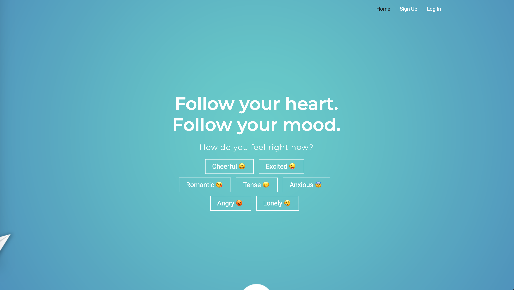
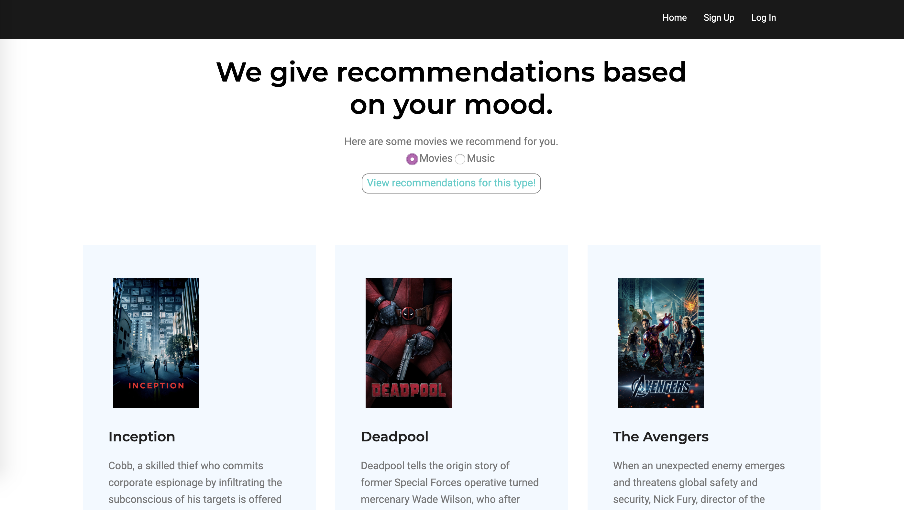

# MoodToDo
This is a web app providing recommendation service in movies, music and restaurants according to your mood. 
 
## MoodToDo makes life easy.
### First Step: Signup (or Don’t!)
You can either sign-up/login as a registered user, or continue as a guest. Only registered users can get access to their preference setting and favorites list.

### Second Step: Choose the mood you are in 
We provide several mood options, choose the mood you are now in!

### Third Step: View Films/Music/Food Recommended for you
Everything will be automatically tailored for you. Based on your mood and preference setting, Mood To Do will customize a list of films, restaurants, and songs which are just right for you!

### Technology Behind the Scene
- Bootstrap for Better CSS design
- JQuery and JQuery Mobile for Web Page Animations
- TMDB API for Movie Database
- iTunes API for Music Database  
- Yelp API for restaurant Database
- Google GSON for JSON Parsing at the Back End

### Software We Used

Contributor: Frost Tianjian Xu, Heather Knutson, Bernard Mindanao, Xuezheng Wu, Benjamin Wassynger
